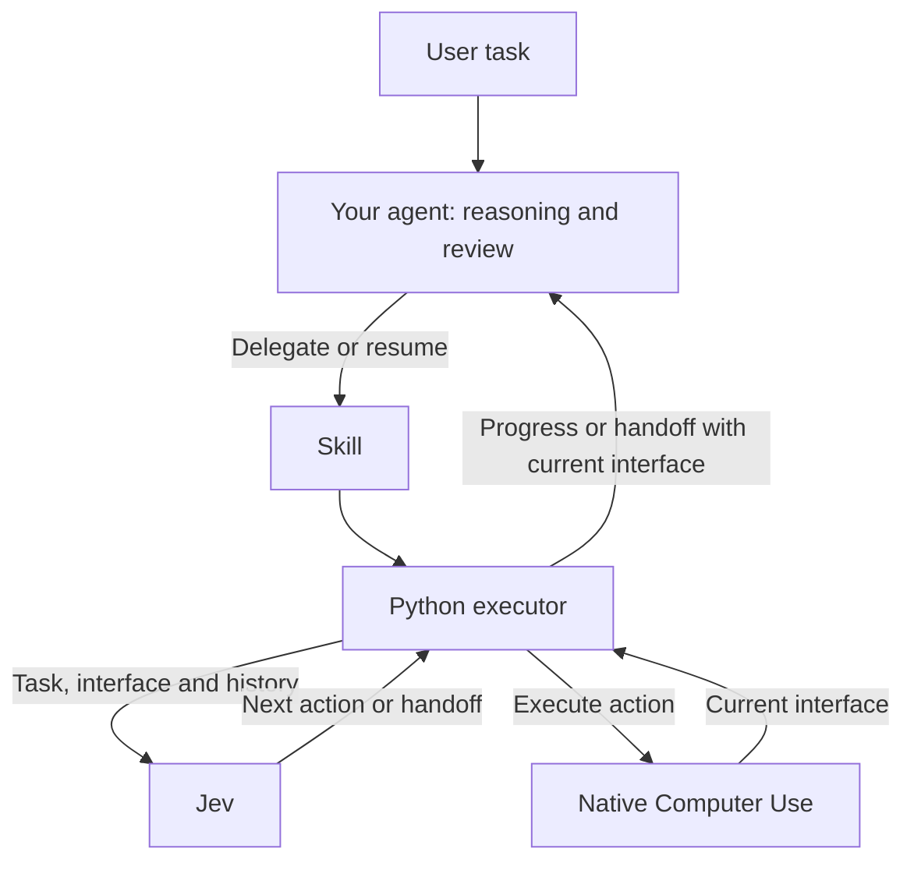

# jev-computer-use-skill

[](https://github.com/Mrchen116/jev-computer-use-skill/actions/workflows/test.yml)
[](LICENSE)


**Let your AI agent delegate repetitive computer tasks to Jev, using fewer LLM calls.**

[中文](docs/README.zh-CN.md) · [Get started](docs/getting-started.md) · [Skill](skills/jev-computer-use/SKILL.md) · [Demos](docs/demos.md) · [Results](evals/README.md) · [Documentation](docs/README.md)

Your agent plans and reasons. **Jev selects the next UI action**, and Python executes
it through native Computer Use. The agent steps in for new text, difficult reasoning
and final verification—without relaying every click through an LLM.



A self-contained **Skill + runner**, with no Python runtime dependencies. No required
starting URL, predicted screen sequence or website-specific routes. Jev sees the
whole task, complete current accessibility tree and every concise step record.

## Watch it work

| Tower Defense Clash · CrazyGames | Garden Defenders | Zoho invoice generator |
| :---: | :---: | :---: |
| https://github.com/user-attachments/assets/868d250d-73a5-4f85-aed3-297e289af58b | https://github.com/user-attachments/assets/94e7fcb5-cbee-4383-ac2f-eef69b9584f7 | https://github.com/user-attachments/assets/2d8004de-8e3c-45e3-b9f4-b8397f276988 |
| Full-health, three-star victory | Three stars, zero mower use | Complete invoice with verified totals |
| **$0.00579** Jev cost | **$0.00388** Jev cost | **$0.01384** Jev cost |
| 137,768 input tokens | 92,367 input tokens | 329,495 input tokens |

Per recorded run, with no intermediate LLM calls. [Jev pricing](https://typesafe.ai/blog/introducing-system-one-models-and-jev):
$0.042 per million input tokens; output is free. Excludes outer-agent setup,
debugging and review, and earlier attempts.

These uncut recordings use the Skill's custom observation/action workflow with
agent-authored Playwright adapters. The default native Computer Use path remains
available for ordinary UI work. [How they work, results and reproduction](docs/demos.md).

## Quick start

Requires **macOS, Python 3.9+, Codex desktop running with Computer Use enabled,
and a TypeSafe Jev API key**. This is an experimental community integration; it
does not bundle or replace the Codex runtime.

```sh
git clone https://github.com/Mrchen116/jev-computer-use-skill.git
cd jev-computer-use-skill
python3 scripts/install.py --configure-key
```

The installer prompts for your key without echoing it, saves it privately outside
Git, and copies the complete Skill into Codex's skills directory. It refuses to
overwrite existing installations or keys. Already have a key file? Omit
`--configure-key` and give your agent its path.

Start a **new agent session**, then ask:

> Use $jev-computer-use to go to https://mrchen116.github.io/, find the voice-input
> project, and return its GitHub link. My key file is
> ~/.config/jev-computer-use/api-key. Use a dedicated browser window.

You provide the task; the agent handles delegation. The CLI route needs no MCP
registration. For an installation check, other agents, MCP setup and permissions,
see [Getting started](docs/getting-started.md).

## What to delegate

| Work | How it runs |
| --- | --- |
| Navigation and forms with known values | `step`: observe → decide → execute; return when input, reasoning or review is needed. |
| Repeated controls on a changing interface | `realtime`: the same loop at an agent-selected minimum cycle interval. Actual latency still depends on the runtime and Jev. |
| Mixed interaction and reasoning | Jev advances recognizable interactions; your agent resolves comparisons, missing text and other reasoning. |
| One click or mostly analysis | Let your agent handle it directly; delegation adds overhead. |

Prepared inputs are literal values, not a UI script. Live status exposes the
app/window, concise history, token usage and warnings. A handoff includes the
**current interface directly**; MCP also preserves the live app binding. Full
private logs are available when earlier screens or diagnostics are needed.

## Selected benchmark results

Real native Computer Use, with **Sol/medium as the outer agent**, including its
startup, reasoning, handoffs and final response in time and token-based cost:

| Evaluation | Completion | Cost vs historical native | Total time vs historical native |
| --- | --- | --- | --- |
| [MiniWoB++](https://github.com/Farama-Foundation/miniwob-plusplus): 3 task types × 3 seeds | 9/9 | **52.7% lower** | **38.5% lower** |
| Local realtime game | 12/12 correct | No valid paired cost claim | 1.21–1.52 s reaction time |

The MiniWoB batch cost **$1.049 vs $2.217**, taking **374 vs 608 seconds**.
These are small historical comparisons, not a universal performance claim.
Codex CLI changed from 0.153.4 to 0.155.1, so strict matched-runtime acceptance
remains unmet. MiniWoB uses relaxed 300-second deadlines and reused seeds.
The native realtime failure was retained, not rerun.

Read the [full report and limitations](evals/computer_use/MINIWOB-RUNTIME.md)
and [reproduction protocols](evals/README.md) for all evaluated scenarios, including
public website tasks. Failed iterations and incomplete
billing remain in the evidence. Prices are API-equivalent token estimates, not
subscription deductions.

## Scope and privacy

- **Accessibility text first.** Jev does not see screenshots. Unsupported controls,
  oversized interfaces or uncertain decisions return to the outer agent.
- **macOS is the tested platform.** The architecture supports native applications;
  current completion evidence is principally Chrome. A TextEdit check was blocked
  on permission and is not counted as desktop-app success.
- **The host owns completion and authorization.** Confidence is not proof of success.
  No nested LLM, automatic permission approval or replay of uncertain mutations.
- **UI text is sent to TypeSafe for decisions.** Logs can contain screen text and
  prepared inputs. Keep keys/logs outside Git and choose tasks accordingly.
- **One controller at a time.** Keep the Mac unlocked and the intended window
  available. Never let the worker and another agent manipulate the same UI together.

See [Security](SECURITY.md) and [runtime compatibility](docs/runtime.md).

## For contributors

```sh
python3 -m venv .venv
. .venv/bin/activate
python3 -m pip install -e .
python3 -m unittest discover -s tests -q
python3 -m unittest discover -s evals/computer_use -q
python3 scripts/check_release.py
```

| Directory | Purpose |
| --- | --- |
| `skills/jev-computer-use/` | Self-contained Skill and canonical Python source |
| `scripts/` | Installation and publication checks |
| `tests/` | Offline behavior and transport tests |
| `evals/` | Real-run harnesses, protocols and sanitized evidence |
| `docs/` | Setup, architecture, runtime and verification guides |

The historical stage engine remains available for reproducing old experiments;
it is not the default Skill workflow. See [Contributing](CONTRIBUTING.md),
[Architecture](docs/architecture.md), [Changelog](CHANGELOG.md) and [MIT license](LICENSE).
