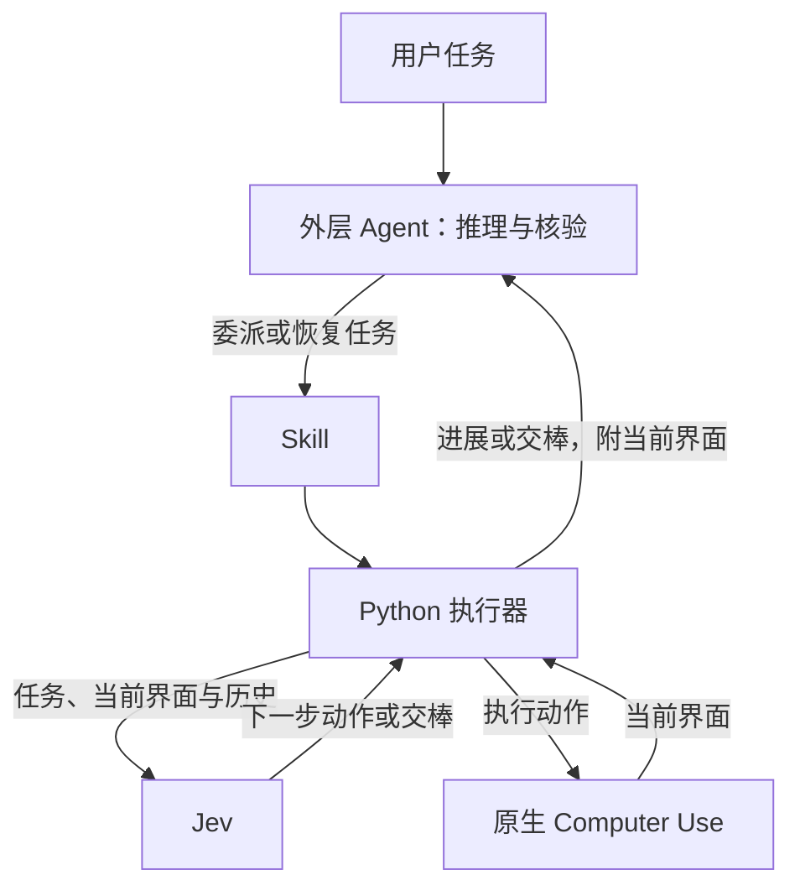

# jev-computer-use

**让 Codex 等 AI Agent 把重复电脑操作交给 Jev，减少 LLM 调用。**

[English](../README.md) · [安装指南](getting-started.md) · [Skill](../skills/jev-computer-use/SKILL.md) · [实测与复现](../evals/README.md)

这是一个自包含的 **Skill + Python 执行器**。用户给出任务，外层 Agent 决定是否委派；
Jev 根据完整任务、当前完整无障碍界面和每一步简洁历史选择下一步，代码直接执行。
需要新文本、复杂推理或最终核验时，再交还外层 Agent。每次点击不经过 LLM 转发。



## 安装后直接提任务

需要 **macOS、Python 3.9+、已启用 Computer Use 且保持运行的 Codex 桌面端，以及
TypeSafe Jev API key**。Python 执行器没有第三方依赖，但不附带 Codex 原生运行时。

```sh
git clone https://github.com/Mrchen116/jev-computer-use.git
cd jev-computer-use
python3 scripts/install.py --configure-key
```

安装器通过隐藏输入接收 key，以 `0600` 权限保存到仓库外的
`~/.config/jev-computer-use/api-key`，然后安装完整 Skill。已有安装或 key 不会被覆盖。
已有 key 文件可省略 `--configure-key`，将文件路径告诉 Agent 即可，不要把密钥发进聊天。

重新开启 Agent 会话后说：

> 用 $jev-computer-use 去 https://mrchen116.github.io/ 找语音输入项目，给我 GitHub 链接。
> key 文件在 ~/.config/jev-computer-use/api-key。请使用专用浏览器窗口。

用户不需要生成 JSON、问题或操作列表。没有注册 MCP 时，Skill 使用 CLI；经常使用时建议
按[安装指南](getting-started.md)注册 MCP，让 Jev 与外层共享原生会话和当前应用绑定。
其他 Agent 可以调用 CLI，但仍依赖运行中的 Codex 原生 Computer Use。

## 适合什么任务

- **连续网页或应用操作：** `step` 模式逐步观察、判断和执行，适合导航及已知值表单。
- **周期性响应：** `realtime` 模式由外层设置最小周期；实际响应仍受观察、推理和执行延迟影响。
- **操作中夹杂推理：** Jev 推进可识别的交互，比较、计算、综合判断和新文本由外层处理。
- **单次点击或主要靠推理：** 外层直接做更合适，委派本身也有开销。

不要求起始 URL，不预设各界面的路线。外层可以准备明确的输入值；Jev 决定聚焦哪个输入框、
何时使用哪个值。输入与提交是独立动作。进展包含应用、窗口、全部简洁历史、用量和告警；
交棒直接给当前完整界面，日志用于查旧界面和诊断。只有外层能确认整个任务已完成。

## 部分基准测试结果

时间包含外层 Sol/medium 的启动、推理、交棒和最终回答；费用按外层 LLM 与 Jev 的实际
计量 token 换算，不是订阅账户扣费。

| 场景 | 完成情况 | 相对历史原生费用 | 总耗时 |
| --- | --- | --- | --- |
| MiniWoB：三类任务，各三个种子 | 9/9 | **降低 52.7%** | **减少 38.5%** |
| 自建即时小游戏 | 12/12 正确 | 不作配对结论 | 反应 1.21–1.52 秒 |

MiniWoB 合计 **$1.049 / 374 秒**，历史原生为 **$2.217 / 608 秒**。
不过 CLI 版本从 0.153.4 变为 0.155.1，严格同版本验收仍未满足；样本少、种子复用、
时限放宽到 300 秒，不是官方榜单成绩。
原生实时小游戏的历史失败没有重跑。包括真实网站任务在内的全部结果、限制与失败记录见[报告](../evals/computer_use/MINIWOB-RUNTIME.md)。

## 使用边界

项目仍处于实验阶段，不能保证任何电脑任务都更快更省。Jev 读取无障碍文字，不看截图；
不支持的控件、超大界面和不确定情况会交还外层。当前完成率证据主要来自 Chrome；
TextEdit 检查停在权限请求，不能算本地应用验证成功。

界面文字会发送给 TypeSafe；日志可能包含私人内容和输入值，请存放在仓库外。
运行时正常权限仍然生效，不自动批准授权，不自动重放不确定操作。
保持电脑解锁，避免多个控制器同时操作。参见[安全说明](../SECURITY.md)和[运行时说明](runtime.md)。

开发与贡献入口见[文档索引](README.md)、[贡献指南](../CONTRIBUTING.md)和[更新记录](../CHANGELOG.md)。
