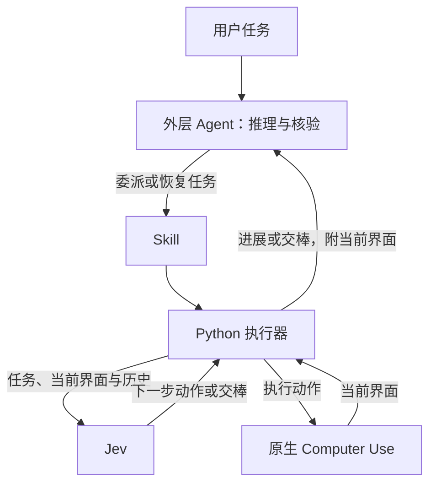

# jev-computer-use-skill

[](https://github.com/Mrchen116/jev-computer-use-skill/actions/workflows/test.yml)
[](../LICENSE)


**让 AI Agent 把重复电脑操作交给 Jev，减少 LLM 调用。**

[English](../README.md) · [安装指南](getting-started.md) · [Skill](../skills/jev-computer-use/SKILL.md) · [演示视频](demos.md) · [实测结果](../evals/README.md) · [文档](README.md)

外层 Agent 负责规划和推理，**Jev 选择下一步界面操作**，Python 通过原生 Computer Use 执行。
需要新文本、复杂推理或最终核验时，外层 Agent 再接手；每次点击不经过 LLM 转发。



这是一个自包含的 **Skill + 执行器**，Python 运行时无第三方依赖。不要求起始 URL，
也无需预测界面路线或预置网站专用流程。Jev 获得完整任务、当前完整无障碍界面和每一步简洁记录。

## 看实际运行

| CrazyGames 塔防 | Garden Defenders | Zoho 发票生成器 |
| :---: | :---: | :---: |
| https://github.com/user-attachments/assets/868d250d-73a5-4f85-aed3-297e289af58b | https://github.com/user-attachments/assets/94e7fcb5-cbee-4383-ac2f-eef69b9584f7 | https://github.com/user-attachments/assets/2d8004de-8e3c-45e3-b9f4-b8397f276988 |
| 满血、三颗星通关 | 零割草机、三颗星通关 | 完整填写并核验金额 |
| **$0.00579** Jev 费用 | **$0.00388** Jev 费用 | **$0.01384** Jev 费用 |
| 输入 137,768 token | 输入 92,367 token | 输入 329,495 token |

以上为对应录像单次运行的费用，运行中无 LLM 介入。[Jev 单价](https://typesafe.ai/blog/introducing-system-one-models-and-jev)：
输入 $0.042／百万 token，输出免费；不含外层 Agent 的准备、调试、核验和此前失败轮次。

三个视频均为原速完整录制，使用 Skill 的自定义观测与动作流程，由 Agent 编写 Playwright 适配器。
普通界面任务走默认原生 Computer Use。[实现方式、结果与复现](demos.md)。

## 快速开始

需要 **macOS、Python 3.9+、运行中的 Codex 桌面端及其 Computer Use 能力，以及
TypeSafe Jev API key**。这是实验性社区集成，不捆绑或替代 Codex 运行时。

```sh
git clone https://github.com/Mrchen116/jev-computer-use-skill.git
cd jev-computer-use-skill
python3 scripts/install.py --configure-key
```

安装器通过隐藏输入接收 key，保存在仓库外，并将完整 Skill 安装到 Codex 的 skills 目录。
它不会覆盖已有安装或 key。若已有 key 文件，可省略 `--configure-key`，把文件路径告诉 Agent。

开启**新的 Agent 会话**，然后说：

> 用 $jev-computer-use 去 https://mrchen116.github.io/ 找语音输入项目，给我 GitHub 链接。
> key 文件在 ~/.config/jev-computer-use/api-key。请使用专用浏览器窗口。

你只需提出任务，Agent 会处理委派。CLI 路径无需注册 MCP。安装检查、其他 Agent、
MCP 设置与权限说明见[安装指南](getting-started.md)。

## 适合什么任务

| 任务 | 执行方式 |
| --- | --- |
| 导航和已知值表单 | `step`：观察 → 判断 → 执行；需要输入、推理或核验时交棒。 |
| 持续变化的界面上的重复操作 | `realtime`：以 Agent 设置的最小周期运行同一循环；实际延迟仍取决于运行时和 Jev。 |
| 操作与推理混合 | Jev 推进可识别的交互；比较、缺失文本等推理由外层 Agent 处理。 |
| 单次点击或主要靠分析 | 外层 Agent 直接处理；委派有额外开销。 |

预设输入是原样填写的值，不是界面操作脚本。实时进展包含应用／窗口、简洁历史、token 用量和告警。
交棒时**直接附当前界面**；MCP 还会保留当前应用绑定。需要查看更早的界面或诊断时可读取私有日志。

## 部分基准测试结果

测试使用原生 Computer Use，外层 Agent 为 **Sol/medium**。时间和按 token 换算的费用
均包含外层 Agent 的启动、推理、交棒及最终回答：

| 评测 | 完成情况 | 相对历史原生费用 | 相对历史原生总耗时 |
| --- | --- | --- | --- |
| [MiniWoB++](https://github.com/Farama-Foundation/miniwob-plusplus)：三类任务 × 三个种子 | 9/9 | **降低 52.7%** | **减少 38.5%** |
| 本地即时小游戏 | 12/12 正确 | 没有有效的配对费用结论 | 反应 1.21–1.52 秒 |

MiniWoB 批次费用为 **$1.049 对 $2.217**，耗时 **374 对 608 秒**。
这些是小样本历史比较，不代表普遍性能。Codex CLI 从 0.153.4 变为 0.155.1，
因此严格同版本验收仍未满足。MiniWoB 时限放宽至 300 秒，且复用了种子。
原生实时任务的失败记录仍保留，未重新测试。

所有场景（含公开网站任务）的[完整报告与限制](../evals/computer_use/MINIWOB-RUNTIME.md)及
[复现协议](../evals/README.md)保留了失败迭代和未完整计费的数据。
所列价格是 API token 换算估计，不是订阅账户实际扣费。

## 范围与隐私

- **优先读取无障碍文字。** Jev 看不到截图；遇到不支持的控件、超大界面或不确定决策会交还外层 Agent。
- **已测试平台是 macOS。** 架构支持原生应用，但当前完成证据主要来自 Chrome。TextEdit 检查被权限阻断，不算桌面应用成功案例。
- **完成判断和授权由外层负责。** 模型置信度不是成功证明；不会嵌套调用 LLM、自动批准权限或重放不确定操作。
- **界面文字会发送给 TypeSafe。** 日志可能含屏幕文字和预设输入；请将密钥及日志放在仓库外，并选择合适的任务。
- **一次只运行一个控制器。** 保持 Mac 解锁和目标窗口可用，避免 worker 与另一 Agent 同时操作界面。

参见[安全说明](../SECURITY.md)和[运行时兼容性](runtime.md)。

## 贡献者指南

```sh
python3 -m venv .venv
. .venv/bin/activate
python3 -m pip install -e .
python3 -m unittest discover -s tests -q
python3 -m unittest discover -s evals/computer_use -q
python3 scripts/check_release.py
```

| 目录 | 用途 |
| --- | --- |
| `skills/jev-computer-use/` | 自包含 Skill 与规范 Python 源码 |
| `scripts/` | 安装与发布检查 |
| `tests/` | 离线行为与传输测试 |
| `evals/` | 真实运行工具、协议和脱敏证据 |
| `docs/` | 安装、架构、运行时与验证指南 |

旧版 stage 引擎仍可用于复现历史实验，但不是默认 Skill 流程。
参见[贡献指南](../CONTRIBUTING.md)、[架构说明](architecture.md)、[更新记录](../CHANGELOG.md)和 [MIT 许可证](../LICENSE)。
