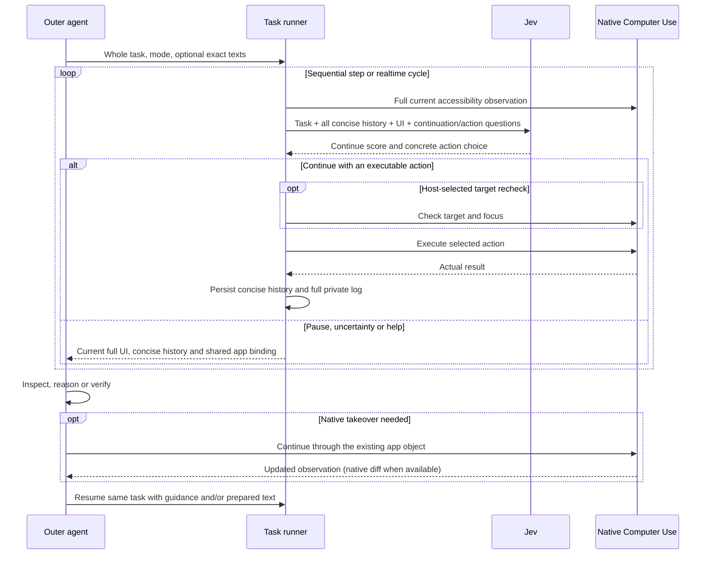

# Architecture

The outer agent is System Two. It owns user intent, reasoning, authorization,
new text, intervention and final verification. Jev is System One: it sees the
whole task and selects concrete operations from the current interface. Delegation
is worthwhile for sustained interaction, not one click or continuous reasoning.

The caller workflow is the [Skill](../skills/jev-computer-use/SKILL.md);
setup and optional controls are in its [reference](../skills/jev-computer-use/references/tasks.md).
Generic interaction and handoff rules live in `tasks.py`, rather than being
regenerated inside each outer-agent delegation.

## Modules

- `computer.py`: full native observations, app inventory, supported control
  actions, focused text operations and execution. Uses the existing AX role
  parser without inheriting page filtering or control pagination.
- `tasks.py`: batched continuation and next-action choices, exhaustive group selection above 255 options, cycle coordination, host handoffs,
  complete step history, progress, journal and persistent resumption.
- `task_cli.py`: default shell/package entrypoint and MCP tool schema.
- `mcp.py`: native transport, optional `delegate_task` and retained observation reads, using the same runner. Jev execution and host native actions share one CUA session and app binding. The first handoff replays native method documentation if the host has not received it.
- `control.py`: minimum cycle spacing without queued catch-up.
- `runtime.py`: installed native CUA transport; no model dispatch or permission bypass.
- `models.py`: typed Jev request/response and actual token accounting.

The context contains whole intent, all concise steps, the complete current AX
content in compact structural syntax (the original remains verbatim in the log),
named exact input texts and warnings. UI data is not host instruction. Supported
actions are generated from observed roles/focus, not inferred application routes.
There is no collection or evidence-sufficiency decision in the generic executor.

Inputs are optional host-authored text/purpose pairs. Focus makes replace/insert
options available; Jev selects them. The code never fills by matching a field
label to a prepared dictionary, and input does not automatically submit.
Native input options quote immediately preceding AX sibling text when available;
the code does not claim it is a semantic label. Missing text does not remove a
task requirement. Readonly fields remain clickable but have no value-assignment option.

The first question can continue, request terminal review, or ask for reasoning
when the current interface has reached an unresolved comparison. It does not
pause merely because the whole task needs reasoning later. This gate runs before
the next-action choice can execute, even if that second answer proposes a click.
The continuation threshold is a model-uncertainty handoff heuristic. Native AX may
retain controls under an overlay, and a high continuation score has occurred after
a terminal failure. It is neither a reliable terminal detector nor an occlusion check.

Progress atomically includes all concise history. The journal stores complete
observations, model requests/responses and action effects linked by step number.
A private checkpoint retains history, texts, application and actual token totals
across process handoffs. A directory lock prevents concurrent writers for a task.
The host must also avoid concurrent controllers across different task directories.

Handoffs return concise state/history and the full latest interface directly.
MCP sends the tree once as plain text plus metadata and the existing app binding;
the caller can continue in that native session without rebinding or navigating.
CLI returns the same UI inline but cannot transfer JS variables across processes.
The physical app remains open in both cases. Execution errors mark the last
observation as needing refresh before further action.

Earlier screens can be read by exact ID or literal text search from the private
log. Raw diffs and full observations are omitted from routine progress polls.

No exception triggers automatic mutation replay. A cooperative stop after an
in-flight model response prevents its action. Completion is always an explicit
outer-agent verdict. Logs and checkpoints are private task data, not release artifacts.

## Historical implementations

`stages.py`, `collection.py`, `evidence.py`, `stage_cli.py` and their tests
remain for the already-published web-stage experiment. MCP exposes them only with
`--legacy-stages`. The older `cli.py` / `host.py` discovery worker can still be
invoked as a Python module for historical reproduction. Neither is the default
Skill/package route. Their measured performance does not validate the redesigned
general task loop.

The Jev model view compacts static AX syntax without relevance filtering. Exact saved-screen IDs let the host batch log reads; see [context and handoff investigation](context-and-handoff.md).
