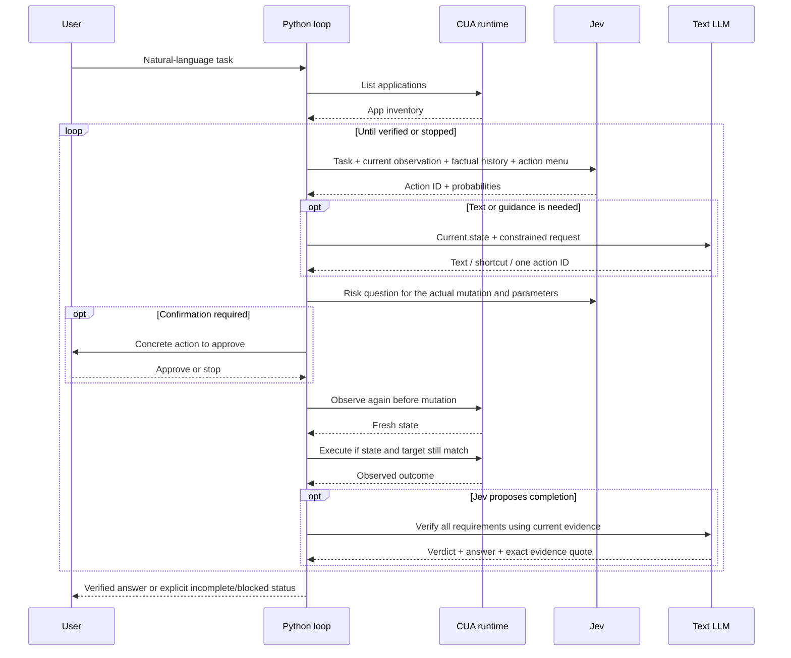

# Architecture

The policy loop does not know macOS element lookup or MCP framing. Its execution boundary is `Desktop.observe()`, `Desktop.execute(action, value)` and `Desktop.close()`.

The diagram shows conditional calls; view changes and initial app selection do not require a separate risk inference. UI execution never depends on LLM tool forwarding.

## Responsibilities

| Module | Owns |
| --- | --- |
| `cli.py` | Budgets, decision loop, text-help triggers, confirmation and completion |
| `desktop.py` | App discovery, AX roles, current control menu, scopes/paging, native mutations and fill verification |
| `runtime.py` | Installed manifest discovery, stdio JSON-RPC, native approval forms, child-process lifecycle |
| `models.py` | Jev HTTP calls/response validation and temporary structured Codex text requests |
| `state.py` | Last-six-step factual state and metadata-only report projection |
| `doctor.py` | Read-only prerequisites check |

The native runtime is a real external dependency. Offline tests cover state, parsers, response validation, private log projection and text-client boundaries; a synthetic native smoke runs against the installed runtime. A successful fake cannot establish real desktop support.

## Decisions and trade-offs

One flat action-choice question keeps operation and target coupled. A separate risk question is about the actual action after any LLM override. We did not adopt speculative operation/target heads without a controlled comparison.

The app inventory is the initial observation. Tab controls are a separate reachable scope. Large control sets are paged; content remains available for reasoning. This reduces incidental tab noise but does not turn observations into a comprehensive privacy filter.

Input values are generated when needed, rather than requiring a caller to prefill every slot. This helps exploratory tasks but causes extra LLM calls and exposes more state to the helper. A strict LLM-call ceiling makes that cost visible and bounded.

The final quote check proves that the quoted text was observed. It does not prove the LLM's interpretation, scope, or ordering is correct. For fixed workflows, deterministic application-specific assertions can be stronger; the built-in synthetic smoke uses them independently.

The integration is text-first and macOS-specific. No adapter framework or fallback OS injection backend is included. Runtime failures are reported rather than silently switching control mechanisms.
